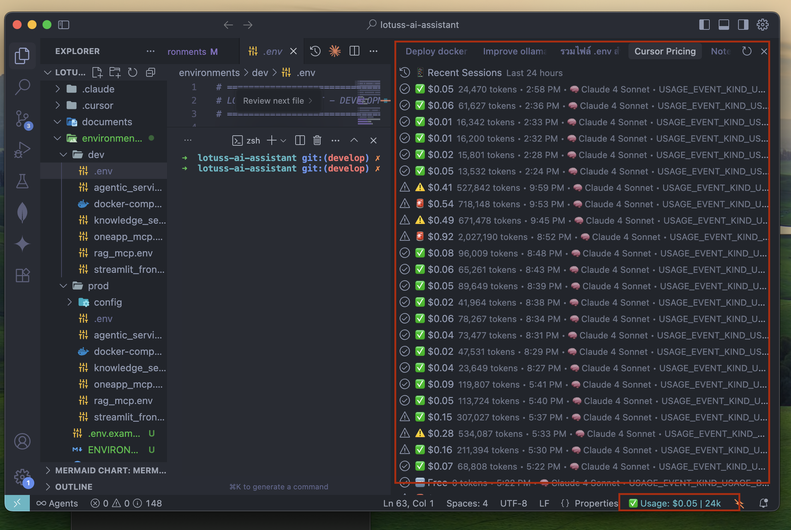

# 💰 Cursor Usage & Cost Tracker

> **Monitor your Cursor AI usage, token consumption, and costs in real-time**

[](https://open-vsx.org/extension/Ittipong/cursor-price-tracking)
[](LICENSE)
[](https://github.com/Ittipong/cursor-price-tracking)
[](https://github.com/Ittipong/cursor-price-tracking/pulls)
[](https://open-vsx.org/extension/Ittipong/cursor-price-tracking)
[](https://open-vsx.org/extension/Ittipong/cursor-price-tracking)

Track your Cursor AI spending with comprehensive usage monitoring directly in VS Code. Never be surprised by your AI usage costs again!



## 🚀 Quick Setup

### 1. Get Your Session Token
1. Go to [cursor.com/dashboard](https://cursor.com/dashboard) (make sure you're logged in)
2. Press `F12` → **Application** tab → **Storage** → **Cookies** → **https://cursor.com**
3. Find `WorkosCursorSessionToken` and copy its value
4. Paste the token when the extension prompts you

### 2. Install & Use
1. Install from [Open-VSX Registry](https://open-vsx.org/extension/Ittipong/cursor-price-tracking)
2. Extension activates automatically
3. View usage in the "Cursor Price Tracking" panel
4. Check costs in the status bar

📊 **Extension Registry**: [Open-VSX Registry](https://open-vsx.org/extension/Ittipong/cursor-price-tracking)

## ✨ Features

- **Real-time usage tracking** for last 24 hours
- **Cost monitoring** with color-coded indicators (✅ Low, ⚠️ Medium, 🚨 High)
- **Model breakdowns** (Claude, GPT, etc.) with token counts
- **Status bar integration** with click-to-refresh
- **Privacy first** - token stays local, direct API communication only

## 🛠️ Commands

| Command | Description |
|---------|-------------|
| `Refresh Usage Data` | Update panel with latest data |
| `Configure Session Token` | Set up your token |
| `Debug API` | Test connectivity |

## ⚙️ Configuration

| Setting | Description | Default |
|---------|-------------|---------|
| `cursorPriceTracking.sessionToken` | Your Cursor session token for API access | `""` |

**To configure:**
- Open VS Code Settings: `Ctrl+,` (Windows/Linux) or `Cmd+,` (Mac)
- Search for "cursor price tracking"
- Paste your session token in the "Session Token" field

## 🚨 Troubleshooting

**"No session token configured"** → Follow setup guide above  
**"Error fetching data"** → Check internet, verify you're logged into cursor.com, get fresh token  
**"No usage data"** → Use Cursor AI first, or check if all usage was free/included  

## 🤝 Contributing

We welcome contributions! 

1. Fork the repository
2. Create feature branch: `git checkout -b feature/amazing-feature`
3. Make changes and test with `F5` in VS Code
4. Commit: `git commit -m 'feat: add amazing feature'`
5. Push and create Pull Request

### Development Setup
```bash
git clone https://github.com/Ittipong/cursor-price-tracking.git
cd cursor-price-tracking
npm install
npm run watch  # Start development
# Press F5 to test
```

## 📄 License

MIT License - see [LICENSE](LICENSE) file.

**Privacy**: Your session token stays local. Extension communicates only with Cursor's official API.

## ☕ Support This Project

If this extension helps you save money and track your AI costs, consider buying me a coffee! ☕

[](https://buymeacoffee.com/ittipongit7)

**Or scan the QR code:**


**Or use the widget:**
<script type="text/javascript" src="https://cdnjs.buymeacoffee.com/1.0.0/button.prod.min.js" data-name="bmc-button" data-slug="ittipongit7" data-color="#FFDD00" data-emoji=""  data-font="Cookie" data-text="Buy me a coffee" data-outline-color="#000000" data-font-color="#000000" data-coffee-color="#ffffff" ></script>

Your support helps maintain and improve this free extension! 🙏

---

## 🔗 Quick Links

⭐ **Star the repo** if this helps track your AI costs!  
🐛 **Report issues**: [GitHub Issues](https://github.com/Ittipong/cursor-price-tracking/issues)  
📦 **Open-VSX Registry**: [Install Extension](https://open-vsx.org/extension/Ittipong/cursor-price-tracking)  
📊 **Open-VSX Registry**: [Extension Page](https://open-vsx.org/extension/Ittipong/cursor-price-tracking)